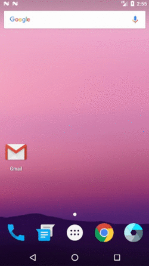

# Exemplo consulta API usando Retrofit

Neste exemplo foi construída uma comunicação com uma API (Application Programming Interface) on-line, não havendo tratamento dos dados como imagens do clima, tradução dos dados recebidos, conversão dos mesmos… entre outros recursos que poderiam ser adicionados para uma melhor visibilidade dos dados buscados na API. O exemplo se ateve apenas ao básico que é a comunicação com um serviço que disponibiliza dados para serem lidos e interpretados pela aplicação cliente. Para mais detalhes a respeito de como tratar os dados você pode ver na seguinte extensão em meu repositório <a href="https://github.com/jhonatasrm/toolbar-weather">Toolbar Weather</a>(uma extensão para o navegador Firefox, que pode ser baixada e instalada, <a href="https://addons.mozilla.org/en-US/firefox/addon/toolbar-weather">aqui</a>).

O exemplo conta com os seguintes recursos (para entender seus funcionamentos):

* Mostrar ProgressBar enquanto carrega os dados ao fundo
* Uso do arquivo strings.xml para utilizar outros idiomas dentro do aplicativo (conforme o idioma do celular)
* Fixar orientação da tela (AndroidManifest.xml)
* Utilização da API Retrofit para consumir serviços de uma API on-line 
* Exibir os resultados da busca de dados de uma API on-line

### API utilizada
Foi utilizada para o exemplo a API [OpenWeatherMap](https://openweathermap.org) (acesse para obter uma key)

### Licença
Este repositório está disponível sob a licença [Mozilla Public License, version 2.0](https://github.com/jhonatasrm/exemplo-consulta-API-usando-Retrofit/blob/master/LICENSE)
